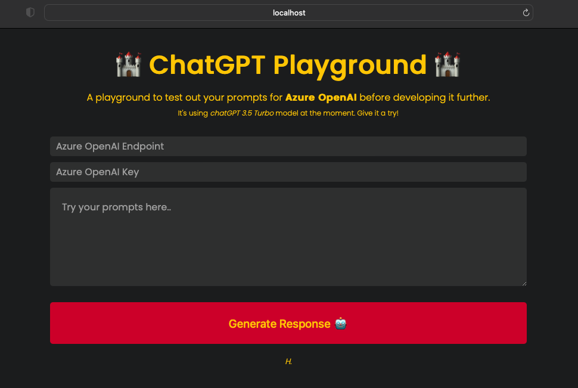
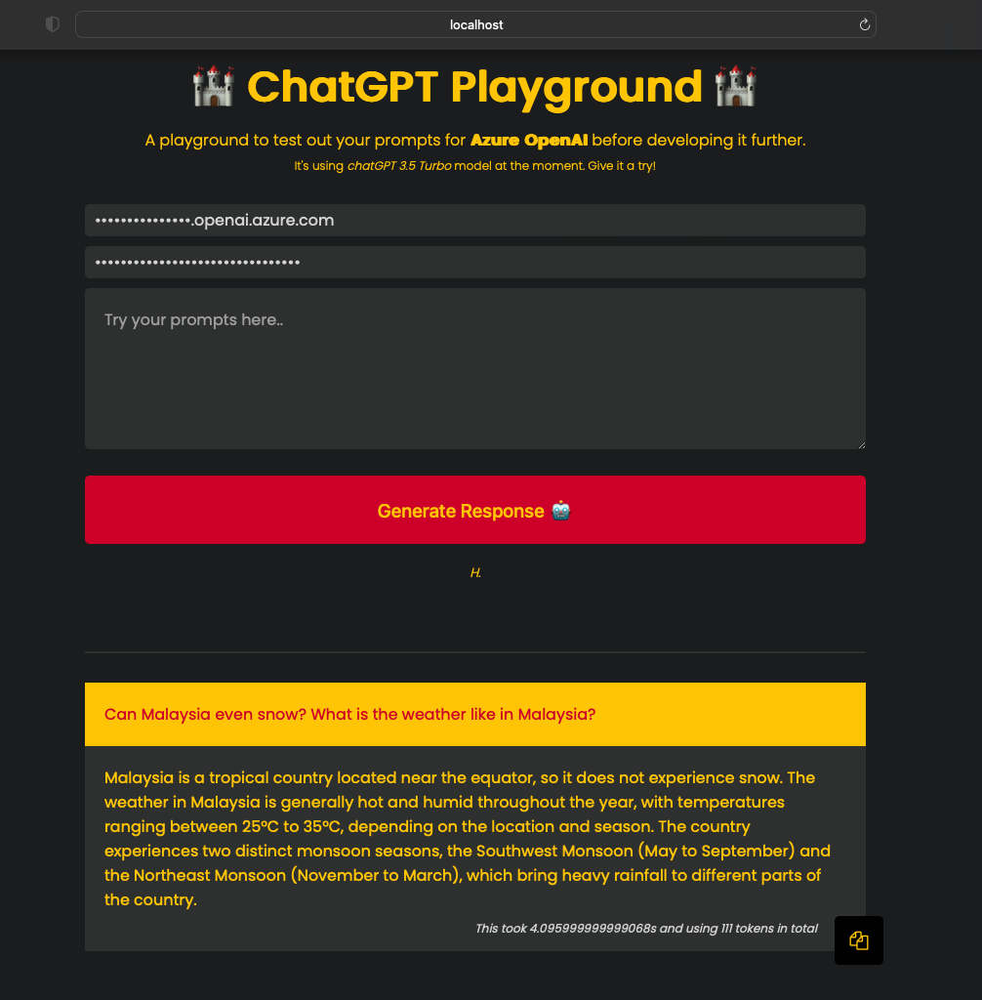

# chatgpt-playground

Azure OpenAI chatGPT Playground. This is powered by chatGPT 3.5 Turbo Model.

## Prerequisite
- Azure OpenAI Endpoint
- Azure OpenAI Key

## Credits
This is an adaption of tutorial from [kinsta.com](https://kinsta.com/blog/chatgpt-clone/).

### Back up.
- npx create-react-app .
- npm install @azure/openai
- npm install --save font-awesome

